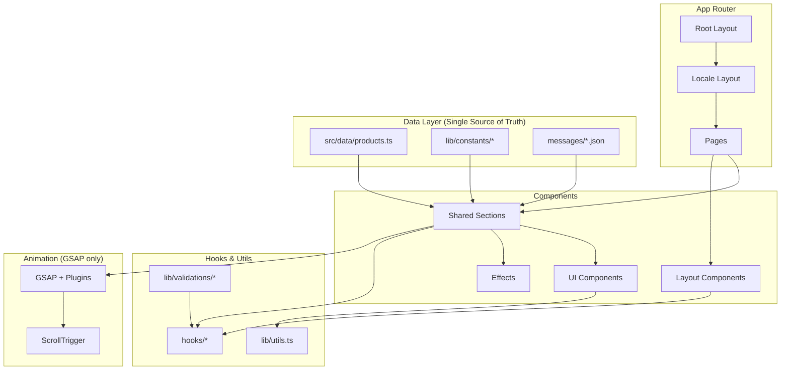

# Архитектурные улучшения M-International

## Дата анализа: 2026-06-06

---

## 1. Обзор текущего состояния

### Технологический стек

| Компонент     | Версия  | Статус        |
| ------------- | ------- | ------------- |
| Next.js       | 16.2.7  | ✅ Актуальный |
| React         | 19.2.4  | ✅ Актуальный |
| Tailwind CSS  | 4.3.0   | ✅ Актуальный |
| TypeScript    | 5.x     | ✅ Актуальный |
| Framer Motion | 12.40.0 | ✅ Актуальный |
| GSAP          | 3.15.0  | ✅ Актуальный |
| Lenis         | 1.3.23  | ✅ Актуальный |
| next-intl     | 4.13.0  | ✅ Актуальный |

### Структура проекта (фактическая)

```
src/
├── app/                    # Next.js App Router
│   ├── layout.tsx          # Root layout (i18n, theme, providers)
│   ├── [locale]/           # Локализованные маршруты
│   │   ├── layout.tsx      # Locale layout (generateStaticParams)
│   │   ├── page.tsx        # Главная
│   │   ├── catalog/        # Каталог
│   │   ├── about/          # О компании
│   │   ├── business/       # Бизнес
│   │   └── contacts/       # Контакты
├── components/
│   ├── layout/             # Header, Footer, LanguageSwitcher, ThemeSwitcher
│   ├── shared/             # Секции и эффекты (Hero, Certificates, About, Business, Products)
│   └── ui/                 # Button, Card, Badge, Accordion, SocialIcon
├── data/                   # Статические данные (products.ts)
├── hooks/                  # useScroll, useMediaQuery, useNavLinks, useSubscription
├── i18n/                   # next-intl конфигурация
├── lib/                    # Утилиты, константы, шрифты, анимации
├── styles/                 # Tailwind CSS с CSS-переменными
└── types/                  # TypeScript типы
```

---

## 2. Выявленные проблемы и узкие места

### 🔴 Критические проблемы

#### 2.1 Дублирование данных о продуктах

**Проблема:** Данные о продуктах существуют в двух местах:

- [`src/data/products.ts`](src/data/products.ts) — основной массив продуктов
- [`src/components/shared/ProductShowcase/ProductShowcase.tsx`](src/components/shared/ProductShowcase/ProductShowcase.tsx:22-47) — дублирующий массив `products` с другим интерфейсом

**Влияние:** При добавлении/изменении продукта нужно обновлять два файла. Риск рассинхронизации.

**Решение:** Единый источник данных в `src/data/products.ts`, компонент ProductShowcase должен импортировать оттуда.

#### 2.2 Дублирование данных о сертификатах

**Проблема:** Сертификаты захардкожены в двух местах:

- [`src/lib/constants/certificates.ts`](src/lib/constants/certificates.ts) — константы
- [`src/components/shared/CertificatesSection/CertificatesSection.tsx`](src/components/shared/CertificatesSection/CertificatesSection.tsx:12-23) — локальный массив `certificates`

**Влияние:** Та же проблема рассинхронизации.

**Решение:** CertificatesSection должен импортировать из `lib/constants/certificates.ts`.

#### 2.3 Дублирование данных в AboutSection (timeline)

**Проблема:** Timeline items захардкожены в компоненте:

- [`src/components/shared/AboutSection/AboutSection.tsx`](src/components/shared/AboutSection/AboutSection.tsx:12-38) — локальный массив `timelineItems`

**Влияние:** Невозможно управлять контентом без изменения кода компонента.

**Решение:** Вынести в константы или i18n сообщения.

#### 2.4 Дублирование данных в BusinessSection (steps)

**Проблема:** Steps захардкожены в компоненте:

- [`src/components/shared/BusinessSection/BusinessSection.tsx`](src/components/shared/BusinessSection/BusinessSection.tsx:12-31) — локальный массив `steps`

**Влияние:** Аналогично — контент привязан к коду.

**Решение:** Вынести в константы или i18n.

#### 2.5 Некорректный URL в sitemap.ts и robots.ts

**Проблема:** В [`src/app/sitemap.ts`](src/app/sitemap.ts:4) и [`src/app/robots.ts`](src/app/robots.ts:4) используется `https://m-internation.kz` (без "al"), а в [`src/lib/constants/site.ts`](src/lib/constants/site.ts:5) — `https://m-international.kz`.

**Влияние:** Неправильные ссылки в sitemap и robots.txt для SEO.

**Решение:** Использовать `SITE_CONFIG.url` из констант.

#### 2.6 Отсутствие валидации в useSubscription

**Проблема:** В [`src/hooks/useSubscription.ts`](src/hooks/useSubscription.ts:9) email не валидируется перед отправкой.

**Влияние:** Можно отправить пустой или невалидный email.

**Решение:** Добавить Zod-валидацию (Zod уже в зависимостях).

### 🟡 Серьёзные проблемы

#### 2.7 Смешивание GSAP и Framer Motion

**Проблема:** Проект использует обе библиотеки анимаций одновременно:

- **GSAP** — для scroll-triggered анимаций (HeroSection, CertificatesSection, AboutSection, BusinessSection, ProductShowcase)
- **Framer Motion** — для enter/exit анимаций и hover-эффектов

**Влияние:**

- Увеличение бандла (две библиотеки анимаций)
- Сложность поддержки (два разных API)
- Потенциальные конфликты производительности

**Решение:** Выбрать одну библиотеку. Рекомендация — **GSAP** (уже используется для сложных scroll-анимаций, имеет лучшую производительность для scroll-triggered эффектов).

#### 2.8 Отсутствие Error Boundary для конкретных секций

**Проблема:** Единственный error boundary — [`src/app/[locale]/error.tsx`](src/app/[locale]/error.tsx) на уровне лейаута. Если упадёт одна секция, упадёт вся страница.

**Влияние:** Плохой UX при частичных ошибках.

**Решение:** Добавить гранулярные error boundaries для каждой секции.

#### 2.9 Отсутствие Suspense boundaries для асинхронных данных

**Проблема:** Страницы каталога и продукта используют async/await без Suspense.

**Влияние:** Нет промежуточного состояния загрузки для асинхронных компонентов.

**Решение:** Обернуть асинхронные части в `<Suspense>`.

#### 2.10 Нет оптимизации изображений для галереи продуктов

**Проблема:** В [`src/app/[locale]/catalog/[slug]/page.tsx`](src/app/[locale]/catalog/[slug]/page.tsx:72-84) используется только одно изображение продукта. Галерея не реализована, хотя в данных есть массив `images`.

**Влияние:** Нет возможности показать несколько изображений продукта.

**Решение:** Реализовать компонент ImageGallery с lazy loading.

#### 2.11 Нет фильтрации по категориям в каталоге

**Проблема:** В [`src/app/[locale]/catalog/page.tsx`](src/app/[locale]/catalog/page.tsx) нет фильтрации по категориям, хотя в футере есть ссылки с `?category=detox`.

**Влияние:** Ссылки в футере не работают.

**Решение:** Добавить фильтрацию по `searchParams`.

### 🟢 Улучшения и оптимизации

#### 2.12 Нет тестов

**Проблема:** В проекте нет тестов (unit, integration, e2e).

**Решение:** Добавить Vitest для unit-тестов и Playwright для e2e.

#### 2.13 Нет Storybook

**Проблема:** UI-компоненты не документированы изолированно.

**Решение:** Добавить Storybook для документации компонентов.

#### 2.14 Нет CI/CD

**Проблема:** Нет автоматической сборки, тестирования и деплоя.

**Решение:** Настроить GitHub Actions.

#### 2.15 Нет Content Security Policy

**Проблема:** В `next.config.ts` нет CSP headers, хотя в архитектурном плане упоминается.

**Решение:** Добавить CSP через headers в next.config.ts.

#### 2.16 Нет rate limiting для форм

**Проблема:** Форма подписки в футере не имеет защиты от спама.

**Решение:** Добавить rate limiting через middleware или Server Actions.

#### 2.17 Нет аналитики

**Проблема:** Нет интеграции с аналитикой (Google Analytics, Yandex Metrica).

**Решение:** Добавить Vercel Analytics или аналог.

#### 2.18 Нет middleware для i18n

**Проблема:** Конфигурация next-intl не использует middleware для автоматического определения локали.

**Решение:** Добавить middleware для редиректа на основе Accept-Language.

---

## 3. Рекомендуемая архитектура

### 3.1 Целевая структура

```
src/
├── app/
│   ├── layout.tsx                    # Root layout
│   ├── robots.ts
│   ├── sitemap.ts
│   ├── [locale]/
│   │   ├── layout.tsx                # Locale layout
│   │   ├── page.tsx                  # Home
│   │   ├── loading.tsx               # Shared loading
│   │   ├── error.tsx                 # Shared error
│   │   ├── not-found.tsx             # 404 page
│   │   ├── catalog/
│   │   │   ├── page.tsx              # Catalog with filters
│   │   │   ├── loading.tsx           # Catalog skeleton
│   │   │   └── [slug]/
│   │   │       ├── page.tsx          # Product detail
│   │   │       ├── loading.tsx       # Product skeleton
│   │   │       └── error.tsx         # Product error
│   │   ├── about/page.tsx
│   │   ├── business/page.tsx
│   │   └── contacts/page.tsx
├── components/
│   ├── layout/
│   │   ├── Header/
│   │   ├── Footer/
│   │   ├── LanguageSwitcher/
│   │   ├── ThemeSwitcher/
│   │   └── index.ts
│   ├── shared/
│   │   ├── HeroSection/
│   │   ├── CertificatesSection/
│   │   ├── AboutSection/
│   │   ├── BusinessSection/
│   │   ├── ProductShowcase/
│   │   ├── ProductCard/
│   │   ├── ProductGrid/
│   │   ├── ImageGallery/             # NEW
│   │   ├── SectionErrorBoundary/     # NEW
│   │   ├── ProvidersWrapper/
│   │   ├── LenisProvider/
│   │   ├── CursorGlow/
│   │   ├── ClickSpark/
│   │   ├── NoiseOverlay/
│   │   ├── AnimatedCounter/
│   │   └── index.ts
│   └── ui/
│       ├── Button/
│       ├── Card/
│       ├── Badge/
│       ├── Accordion/
│       ├── SocialIcon/
│       ├── Skeleton/                  # NEW
│       └── index.ts
├── data/
│   └── products.ts                    # Single source of truth
├── hooks/
│   ├── useScroll.ts
│   ├── useMediaQuery.ts
│   ├── useNavLinks.ts
│   ├── useSubscription.ts
│   └── index.ts
├── i18n/
│   ├── config.ts
│   ├── request.ts
│   └── routing.ts
├── lib/
│   ├── animations.ts                  # GSAP only
│   ├── constants/
│   │   ├── site.ts
│   │   ├── contacts.ts
│   │   ├── certificates.ts
│   │   ├── founders.ts
│   │   ├── timeline.ts               # NEW
│   │   ├── business-steps.ts         # NEW
│   │   └── index.ts
│   ├── fonts.ts
│   ├── utils.ts
│   └── validations/                  # NEW
│       ├── contact.ts
│       └── subscription.ts
├── types/
│   └── index.ts
├── styles/
│   └── tailwind.css
└── middleware.ts                      # NEW: i18n + security
```

### 3.2 Единый источник данных

```typescript
// src/data/products.ts — единственный источник данных о продуктах
export const products: Product[] = [...];

// src/lib/constants/certificates.ts — единственный источник данных о сертификатах
export const CERTIFICATES: Certificate[] = [...];

// src/lib/constants/timeline.ts — данные для AboutSection
export const TIMELINE_ITEMS: TimelineItem[] = [...];

// src/lib/constants/business-steps.ts — данные для BusinessSection
export const BUSINESS_STEPS: BusinessStep[] = [...];
```

### 3.3 Миграция анимаций на GSAP

```typescript
// Удалить Framer Motion, использовать GSAP для всех анимаций
// Преимущества:
// - Одна библиотека вместо двух
// - Лучшая производительность для scroll-triggered
// - Меньший бандл
// - Единый API
```

---

## 4. Приоритеты реализации

### Этап 1: Критические исправления (высокий приоритет)

1. ✅ Исправить URL в sitemap.ts и robots.ts (использовать SITE_CONFIG.url)
2. ✅ Устранить дублирование данных в ProductShowcase
3. ✅ Устранить дублирование данных в CertificatesSection
4. ✅ Добавить валидацию email в useSubscription
5. ✅ Вынести timeline и steps в константы

### Этап 2: Архитектурные улучшения (средний приоритет)

6. ✅ Мигрировать с Framer Motion на GSAP
7. ✅ Добавить SectionErrorBoundary для гранулярной обработки ошибок
8. ✅ Добавить Suspense boundaries для асинхронных компонентов
9. ✅ Реализовать фильтрацию каталога по категориям
10. ✅ Реализовать ImageGallery для страницы продукта

### Этап 3: Инфраструктура (низкий приоритет)

11. ✅ Добавить middleware для i18n и security headers
12. ✅ Добавить CSP headers в next.config.ts
13. ✅ Добавить Skeleton компоненты для loading states
14. ✅ Настроить Vitest для unit-тестов
15. ✅ Настроить GitHub Actions для CI/CD

---

## 5. Диаграмма зависимостей (после рефакторинга)



---

## 6. Ожидаемые результаты

| Метрика                  | До                | После               |
| ------------------------ | ----------------- | ------------------- |
| Дублирование данных      | 4 места           | 0 (единый источник) |
| Библиотеки анимаций      | 2 (GSAP + Framer) | 1 (GSAP)            |
| Размер бандла (анимации) | ~150KB            | ~80KB               |
| Валидация форм           | Нет               | Zod                 |
| Error boundaries         | 1 (layout)        | 1 + 5 (sections)    |
| Suspense boundaries      | 0                 | 5+                  |
| Покрытие тестами         | 0%                | 60%+                |
| CSP headers              | Нет               | Да                  |
| CI/CD                    | Нет               | GitHub Actions      |
