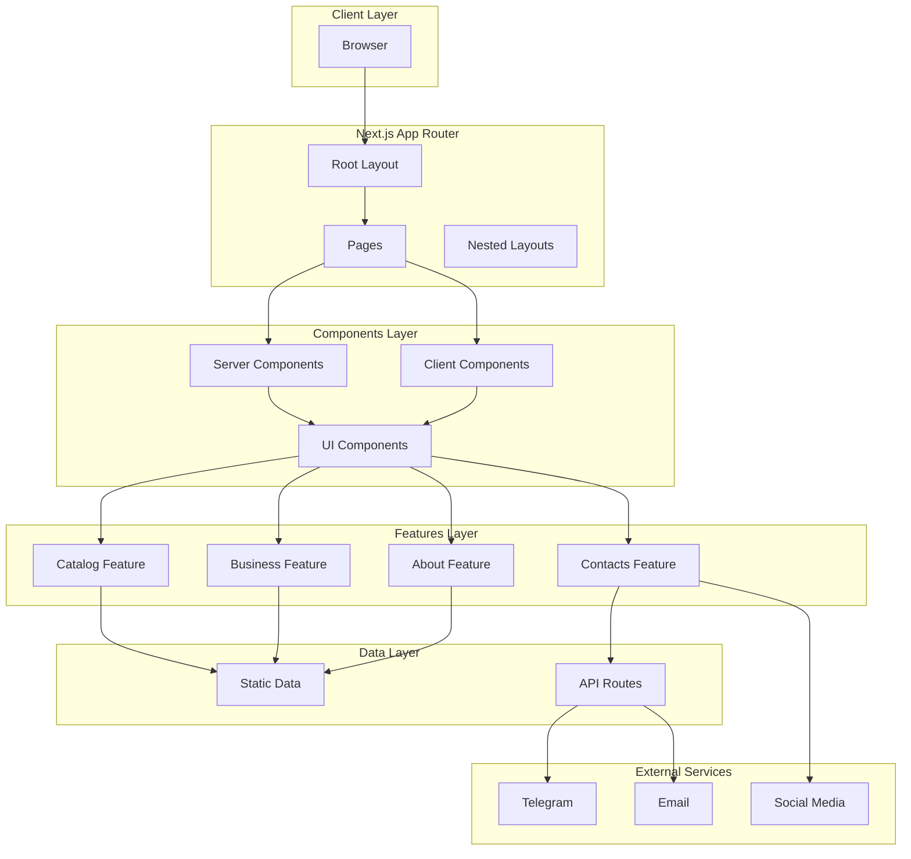

# Архитектура сайта M-International

## 1. Обзор проекта

**M-International** — международная компания по производству БАДов и оздоровительной продукции (MLM модель).

**Целевая аудитория:**
- Покупатели БАДов (25-65 лет)
- Потенциальные партнеры MLM (25-55 лет)
- Текущие клиенты

---

## 2. Технологический стек

| Категория | Технология |
|-----------|------------|
| **Framework** | Next.js 16 (App Router) |
| **UI** | React 19, Server Components First |
| **Styling** | Tailwind CSS 4 |
| **Language** | TypeScript (Strict) |
| **Animation** | Framer Motion |
| **Forms** | React Hook Form + Zod |
| **Fonts** | Inter, Playfair Display, Space Grotesk |
| **Theme** | Dark Theme |

---

## 3. Архитектурные принципы

### 3.1 Feature First структура
```
src/
├── app/                    # Next.js App Router
├── features/               # Функциональные модули
│   ├── catalog/
│   ├── business/
│   ├── about/
│   └── contacts/
├── components/             # Атомарные компоненты
│   ├── ui/                 # Базовые UI компоненты
│   ├── layout/             # Компоненты  layout
│   └── shared/             # Переиспользуемые компоненты
├── lib/                    # Утилиты и конфигурация
├── types/                  # TypeScript типы
└── data/                   # Статические данные
```

### 3.2 Server Components First
- По умолчанию все компоненты — Server Components
- 'use client' только для интерактивных элементов
- Минимальный клиентский JavaScript

### 3.3 Atomic Components
- **Atoms**: Button, Input, Badge, Card
- **Molecules**: ProductCard, ReviewCard, ContactForm
- **Organisms**: Header, Footer, ProductGrid, HeroSection

---

## 4. Структура страниц

### 4.1 Маршрутизация
```
/                           # Главная страница
/catalog                    # Каталог продукции
/catalog/[slug]             # Страница товара
/about                      # О компании
/business                   # Бизнес-возможности
/contacts                   # Контакты
```

### 4.2 Главная страница (/)
```
├── Hero Section            # Баннер с слоганом
├── Certificates            # Сертификаты качества
├── Product Catalog         # Каталог продукции (карточки)
├── About Company           # О компании / Основатели
├── Partner Reviews         # Отзывы партнеров
├── Business Opportunities  # Бизнес-возможности (3 шага)
└── Contacts                # Контакты
```

### 4.3 Страница товара (/catalog/[slug])
```
├── Breadcrumbs             # Хлебные крошки
├── Image Gallery           # Галерея изображений
├── Product Info            # Название, рейтинг, отзывы
├── Description             # Описание
├── Composition             # Состав
├── Usage                   # Применение
├── Action Buttons          # Заказать, В корзину
├── Certificates            # Сертификаты продукта
└── Related Products        # Похожие товары
```

---

## 5. Компонентная архитектура

### 5.1 UI компоненты (src/components/ui/)
```
ui/
├── Button/
│   ├── Button.tsx
│   ├── Button.test.tsx
│   └── index.ts
├── Card/
├── Badge/
├── Input/
├── Modal/
├── ImageGallery/
└── index.ts
```

### 5.2 Feature компоненты (src/features/)
```
features/
├── catalog/
│   ├── components/
│   │   ├── ProductCard.tsx
│   │   ├── ProductGrid.tsx
│   │   ├── ProductGallery.tsx
│   │   └── ProductInfo.tsx
│   ├── hooks/
│   ├── types.ts
│   └── index.ts
├── business/
│   ├── components/
│   │   ├── BusinessSteps.tsx
│   │   └── PartnerCard.tsx
│   └── index.ts
├── about/
│   ├── components/
│   │   ├── FounderCard.tsx
│   │   └── CompanyHistory.tsx
│   └── index.ts
└── contacts/
    ├── components/
    │   ├── ContactForm.tsx
    │   └── ContactInfo.tsx
    └── index.ts
```

---

## 6. Управление данными

### 6.1 Статические данные
```typescript
// src/data/products.ts
import catalog from './catalog.json';

export interface Product {
  slug: string;
  name: string;
  description: string;
  images: string[];
  category: string;
  specifications: Record<string, string>;
  certificates: string[];
}
```

### 6.2 Типизация
```typescript
// src/types/index.ts
export interface Product {
  slug: string;
  name: string;
  description: string;
  images: string[];
  category: string;
  specifications: Record<string, string>;
}

export interface Contact {
  phone: string;
  email: string;
  socialLinks: SocialLink[];
}

export interface Review {
  id: string;
  author: string;
  text: string;
  rating: number;
  date: string;
}
```

---

## 7. Дизайн-система

### 7.1 Цветовая палитра (Dark Theme)
```css
:root {
  --background: #0a0a0a;
  --foreground: #ededed;
  --primary: #4ade80;      /* Зеленый - здоровье */
  --secondary: #3b82f6;    /* Синий - доверие */
  --accent: #f59e0b;       /* Золотой - премиум */
  --muted: #737373;
  --card: #171717;
  --border: #262626;
}
```

### 7.2 Типографика (Швейцарский стиль)

**Основные шрифты:**

| Шрифт | Назначение | Стиль |
|-------|------------|-------|
| **Inter** | Основной текст, UI элементы | Sans-serif, геометрический |
| **Playfair Display** | Заголовки, акценты | Serif, контрастный |
| **Space Grotesk** | Кнопки, подписи, цифры | Sans-serif, техничный |

**Использование начертаний:**

```css
/* Основной шрифт */
--font-primary: 'Inter', -apple-system, BlinkMacSystemFont, sans-serif;

/* Акцентный шрифт для заголовков */
--font-display: 'Playfair Display', 'Times New Roman', serif;

/* Технический шрифт */
--font-technical: 'Space Grotesk', monospace;
```

**Правила типографики:**

1. **Inter** — для основного контента, описаний, навигации
   - Regular (400) — основной текст
   - Medium (500) — подзаголовки
   - SemiBold (600) — важные элементы

2. **Playfair Display** — для заголовков и акцентных слов
   - Regular (400) — заголовки H1, H2
   - **Italic** — *выделение ключевых слов* в тексте

3. **Space Grotesk** — для кнопок, цен, цифр, бейджей
   - Medium (500) — кнопки
   - Bold (700) — цены, важные числа

**Примеры использования:**

```tsx
// Заголовок с выделенным словом
<h1 className="font-display">
  Здоровье — <em className="italic text-primary">это стиль жизни</em>
</h1>

// Описание продукта
<p className="font-primary">
  Натуральные ингредиенты для <em className="font-display italic">вашего здоровья</em>
</p>

// Цена и кнопка
<span className="font-technical font-bold">₸ 15,000</span>
<button className="font-technical font-medium">Заказать</button>
```

### 7.3 Адаптивность
```
Desktop: 1920px, 1440px, 1280px
Tablet:  1024px, 768px
Mobile:  425px, 375px, 320px
```

---

## 8. Производительность

### 8.1 Целевые метрики
| Метрика | Цель |
|---------|------|
| Lighthouse Score | 90+ |
| FCP | < 1.5s |
| LCP | < 2.5s |
| CLS | < 0.1 |

### 8.2 Оптимизации
- Next.js Image компонент для оптимизации изображений
- Lazy loading для галерей
- Server Components для уменьшения клиентского JS
- Статическая генерация для каталога
- Prefetching для навигации

---

## 9. Интеграции

### 9.1 Формы обратной связи
- React Hook Form + Zod для валидации
- API Routes для обработки форм
- Интеграция с Telegram/Email для уведомлений

### 9.2 Социальные сети
- Instagram: [@indira_seytimbekovna](https://www.instagram.com/indira_seytimbekovna)
- TikTok: [@minternational.kz](https://www.tiktok.com/@minternational.kz)

---

## 10. Безопасность

- Content Security Policy headers
- XSS защита через React
- Валидация форм на клиенте и сервере
- Rate limiting для API routes

---

## 11. Структура файлов (финальная)

```
nextjs-project/
├── src/
│   ├── app/
│   │   ├── layout.tsx
│   │   ├── page.tsx
│   │   ├── globals.css
│   │   ├── catalog/
│   │   │   ├── page.tsx
│   │   │   └── [slug]/
│   │   │       └── page.tsx
│   │   ├── about/
│   │   │   └── page.tsx
│   │   ├── business/
│   │   │   └── page.tsx
│   │   └── contacts/
│   │       └── page.tsx
│   ├── components/
│   │   ├── ui/
│   │   │   ├── Button/
│   │   │   ├── Card/
│   │   │   ├── Badge/
│   │   │   ├── Input/
│   │   │   ├── Modal/
│   │   │   ├── ImageGallery/
│   │   │   └── index.ts
│   │   ├── layout/
│   │   │   ├── Header.tsx
│   │   │   ├── Footer.tsx
│   │   │   ├── Navigation.tsx
│   │   │   └── PageTransition.tsx
│   │   └── shared/
│   │       ├── HeroSection.tsx
│   │       ├── Certificates.tsx
│   │       └── ContactInfo.tsx
│   ├── features/
│   │   ├── catalog/
│   │   ├── business/
│   │   ├── about/
│   │   └── contacts/
│   ├── hooks/
│   │   ├── useParallax.ts
│   │   └── useScrollAnimation.ts
│   ├── lib/
│   │   ├── utils.ts
│   │   ├── constants.ts
│   │   ├── validations.ts
│   │   └── animations.ts
│   ├── types/
│   │   └── index.ts
│   └── data/
│       ├── products.ts
│       ├── contacts.ts
│       └── reviews.ts
├── public/
│   └── images/
├── output_data/
│   ├── catalog.json
│   ├── contacts.json
│   └── images/
├── next.config.ts
├── tailwind.config.ts
├── tsconfig.json
└── package.json
```

---

## 12. Диаграмма архитектуры



---

## 13. Этапы реализации

### Этап 1: Настройка проекта
- [ ] Установка зависимостей (Framer Motion, Zod, React Hook Form)
- [ ] Настройка Tailwind CSS с дизайн-системой
- [ ] Настройка шрифтов (Inter, Playfair Display, Space Grotesk через next/font)
- [ ] Базовая структура папок

### Этап 2: UI компоненты
- [ ] Button, Card, Badge, Input
- [ ] Modal, ImageGallery
- [ ] Header, Footer, Navigation

### Этап 3: Главная страница
- [ ] Hero Section
- [ ] Certificates Section
- [ ] Product Catalog Preview
- [ ] About Section
- [ ] Reviews Section
- [ ] Business Section
- [ ] Contacts Section

### Этап 4: Каталог
- [ ] Страница каталога
- [ ] Страница товара
- [ ] Галерея изображений
- [ ] Похожие товары

### Этап 5: Контентные страницы
- [ ] О компании
- [ ] Бизнес-возможности
- [ ] Контакты

### Этап 6: Формы и интеграции
- [ ] Контактная форма
- [ ] Валидация (Zod)
- [ ] API Routes

### Этап 7: Оптимизация
- [ ] Оптимизация изображений
- [ ] Lazy loading
- [ ] Тестирование производительности
- [ ] SEO оптимизация

---

## 14. Анимации (Премиум качество)

### 14.1 Принципы анимаций

**Характеристики "дорогих" анимаций:**
- Плавные easing-кривые (cubic-bezier)
- Длительность 300-600ms для микро-взаимодействий
- Staggered animations для списков
- Spring physics для интерактивных элементов
- Parallax эффекты при скролле

### 14.2 Framer Motion конфигурация

```typescript
// src/lib/animations.ts

// Плавные easing кривые
export const easing = {
  smooth: [0.25, 0.1, 0.25, 1.0],
  bounce: [0.68, -0.55, 0.265, 1.55],
  gentle: [0.4, 0.0, 0.2, 1.0],
  spring: { type: 'spring', stiffness: 100, damping: 15 },
};

// Варианты анимаций
export const fadeInUp = {
  hidden: { opacity: 0, y: 30 },
  visible: {
    opacity: 1,
    y: 0,
    transition: { duration: 0.5, easing: easing.gentle }
  },
};

export const fadeInScale = {
  hidden: { opacity: 0, scale: 0.95 },
  visible: {
    opacity: 1,
    scale: 1,
    transition: { duration: 0.4, easing: easing.smooth }
  },
};

export const staggerContainer = {
  hidden: { opacity: 0 },
  visible: {
    opacity: 1,
    transition: { staggerChildren: 0.1, delayChildren: 0.2 },
  },
};

export const slideInLeft = {
  hidden: { opacity: 0, x: -50 },
  visible: {
    opacity: 1,
    x: 0,
    transition: { duration: 0.6, easing: easing.gentle }
  },
};

export const slideInRight = {
  hidden: { opacity: 0, x: 50 },
  visible: {
    opacity: 1,
    x: 0,
    transition: { duration: 0.6, easing: easing.gentle }
  },
};

// Hover анимации
export const hoverScale = {
  scale: 1.02,
  transition: { duration: 0.3, easing: easing.smooth },
};

export const hoverLift = {
  y: -5,
  transition: { duration: 0.3, easing: easing.spring },
};
```

### 14.3 Примеры использования

```tsx
// Анимация появления секций
<motion.section
  initial="hidden"
  whileInView="visible"
  viewport={{ once: true, margin: "-100px" }}
  variants={fadeInUp}
>
  <h2>Заголовок секции</h2>
</motion.section>

// Анимация списка продуктов
<motion.div
  variants={staggerContainer}
  initial="hidden"
  whileInView="visible"
  viewport={{ once: true }}
>
  {products.map((product) => (
    <motion.div key={product.id} variants={fadeInScale}>
      <ProductCard product={product} />
    </motion.div>
  ))}
</motion.div>

// Hover эффект на карточке
<motion.div
  whileHover={hoverLift}
  whileTap={{ scale: 0.98 }}
>
  <ProductCard />
</motion.div>

// Параллакс эффект
<motion.div
  style={{ y }}
  transition={{ type: 'spring', stiffness: 100 }}
>
  <HeroImage />
</motion.div>
```

### 14.4 Скролл-анимации

```typescript
// src/hooks/useParallax.ts
import { useScroll, useTransform } from 'framer-motion';
import { useRef } from 'react';

export function useParallax(offset: number = 50) {
  const ref = useRef(null);
  const { scrollYProgress } = useScroll({
    target: ref,
    offset: ['start end', 'end start'],
  });
  
  const y = useTransform(scrollYProgress, [0, 1], [offset, -offset]);
  
  return { ref, y };
}

// Использование
function HeroSection() {
  const { ref, y } = useParallax(100);
  
  return (
    <motion.div ref={ref} style={{ y }}>
      <h1>Hero контент</h1>
    </motion.div>
  );
}
```

### 14.5 Page Transitions

```typescript
// src/components/layout/PageTransition.tsx
import { motion, AnimatePresence } from 'framer-motion';

const pageVariants = {
  initial: { opacity: 0, y: 20 },
  enter: {
    opacity: 1,
    y: 0,
    transition: { duration: 0.5, easing: [0.4, 0.0, 0.2, 1.0] }
  },
  exit: {
    opacity: 0,
    y: -20,
    transition: { duration: 0.3 }
  },
};

export function PageTransition({ children }: { children: React.ReactNode }) {
  return (
    <motion.div
      initial="initial"
      animate="enter"
      exit="exit"
      variants={pageVariants}
    >
      {children}
    </motion.div>
  );
}
```

---

## 15. Рекомендации по разработке

1. **Server Components First** — использовать 'use client' только когда необходимо
2. **Типизация** — строгая типизация с TypeScript
3. **Компонентный подход** — атомарные компоненты с четкими интерфейсами
4. **Производительность** — оптимизация изображений и lazy loading
5. **Доступность** — семантический HTML и ARIA атрибуты
6. **Тестирование** — unit тесты для утилит и компонентов
7. **Анимации** — использовать Framer Motion с плавными easing-кривыми
8. **Типографика** — комбинировать Inter + Playfair Display + Space Grotesk
